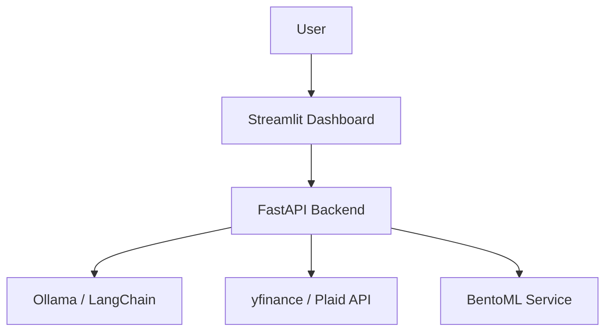

# Intelligent Financial Analysis Dashboard


A professional-grade financial intelligence platform designed for real-time market tracking and automated analysis. This system integrates high-performance asynchronous backends with interactive data visualizations and localized Large Language Models (LLMs) to provide deep semantic insights into financial datasets, stock performance, and predictive trends.

## Table of Contents
- [Tech Stack & Architecture](#tech-stack--architecture)
- [Prerequisites](#prerequisites)
- [Installation & Local Setup](#installation--local-setup)
- [Usage & Running the App](#usage--running-the-app)
- [Testing](#testing)
- [Deployment](#deployment)
- [Contributing Guidelines](#contributing-guidelines)
- [License and Contact](#license-and-contact)

## Tech Stack & Architecture

### Core Technologies
- **Backend API**: `FastAPI` (Asynchronous processing and data orchestration)
- **Frontend Console**: `Streamlit` (Interactive dashboards and Plotly integration)
- **LLM Layer**: `LangChain` with `Ollama` (Localized semantic analysis)
- **Data Sourcers**: `yfinance` (Stock market metrics) and `Plaid` (Financial transactions)
- **Model Serving**: `BentoML` (Unified model packaging and scaling)
- **Visualization**: `Plotly` and `Matplotlib`

### High-Level Architecture
The platform operates as a modular distributed system:
- **`api/`**: Houses localized data retrieval endpoints and security middleware.
- **`ui/`**: Streamlit-based dashboard logic mapping visual metrics.
- **`llm/`**: Computational wrappers for LangChain agents and model prompts.
- **`utils/`**: Generic helper functions for data cleaning and numeric parsing.



## Prerequisites
- **Python**: Version 3.12+ 
- **Ollama**: Local instance running with your targeted LLM (e.g., `llama3`).
- **Tools**: `uv` package manager and `just` (optional, for task automation).

## Installation & Local Setup

```bash
git clone https://github.com/Purusharth1/Financial-Dashboard.git
cd Financial-Dashboard
uv sync
```

### Environment Variables
Construct a `.env` file referencing the `Plaid` credentials and localized API ports:
```bash
PLAID_CLIENT_ID="your_id"
PLAID_SECRET="your_secret"
OLLAMA_BASE_URL="http://localhost:11434"
```

## Usage & Running the App

### Starting the Integrated Stack
Utilize the built-in `just` runner or standard Python calls:
```bash
# Start the Backend
uv run uvicorn api.main:app --port 8000

# Launch the Frontend Dashboard
uv run streamlit run ui/app.py
```
The dashboard will be available at **`http://localhost:8501`**.

## Testing
This project implements robust load testing and modular unit validation.
- **Load Testing**: `uv run locust -f locustfile.py` (Simulates concurrent users on API endpoints)
- **Linting**: `uv run ruff check .` (Enforces modern Python standards)

## Deployment
Packaged with `BentoML`, the entire architecture can be containerized into a single "Bento" and deployed as a microservice to Kubernetes or AWS ECS, decoupling the model execution from the UI components.

## Contributing Guidelines
1. Branch accurately from `main`.
2. Adhere to **Trunk-based development**.
3. Submit **Conventional Commits** (e.g., `feat: integrate plotly candlestick charts`).
4. Ensure code passes the `ruff` ALL-ruleset validation.

## License and Contact
- **License**: MIT
- **Contact**: Purusharth (https://github.com/Purusharth1)
