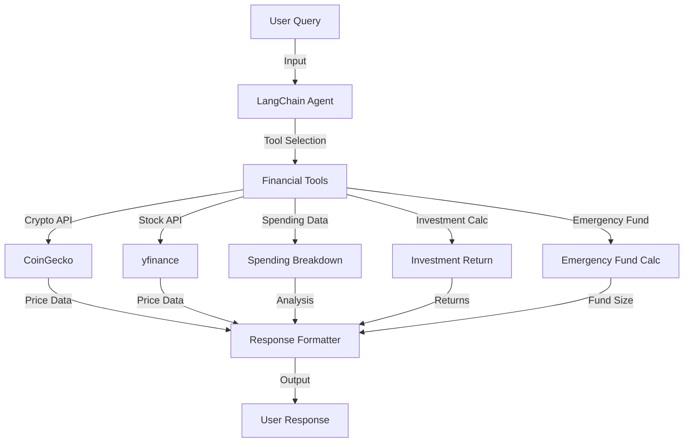

# Project Architecture

The **Financial Dashboard** project uses a modular architecture to integrate AI, external APIs, and user queries efficiently. Below is the system workflow.

## System Workflow

## Components

- **User Query**: Natural language input (e.g., "What's the current price of Bitcoin?").
- **LangChain Agent**: AI agent using Ollama to interpret queries and select tools.
- **Financial Tools**:
  - **CoinGecko API**: Fetches crypto prices (current and historical).
  - **yfinance**: Fetches stock prices (current and historical).
  - **Spending Breakdown**: Analyzes yearly spending data.
  - **Investment Return**: Calculates investment returns.
  - **Emergency Fund Calc**: Estimates emergency fund size.
- **Response Formatter**: Formats outputs with timestamps.

---

## Next Steps

- [Features](features.md)
- [Installation Guide](installation.md)